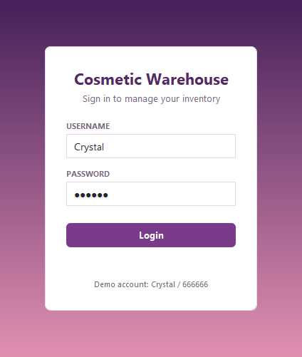
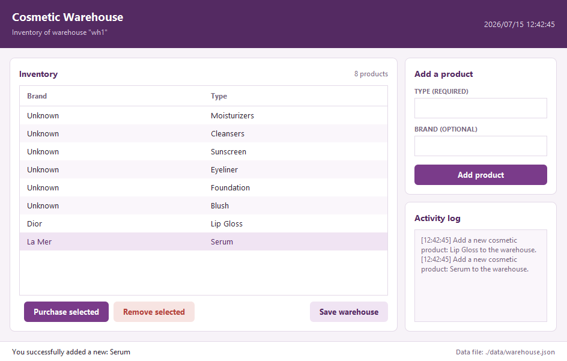

# Cosmetic Warehouse Management Application

## Overview
This project is a desktop application for managing cosmetic products in a warehouse. Users can view, add, remove, and purchase products, and save/load the warehouse state. The backend is implemented in Java with local storage in JSON format; two frontends are provided — a console UI and a Java Swing GUI — both backed by the same model and persistence layer.

The Swing interface uses a custom plum/rose theme built entirely with the standard library (proper layout managers, styled table, rounded flat buttons) — no extra UI dependencies — so it stays fully offline and reproducible.

The application code lives in [`project_z4p0g/`](project_z4p0g/).

## Screenshots

| Login | Warehouse |
| --- | --- |
|  |  |

## Features
- **View products**: the inventory is shown as a full table (brand and type) with a live product count — no more scrolling through a combo box.
- **Add products**: type is required, brand is optional (defaults to `Unknown`); press Enter in either field or click *Add product*.
- **Remove products**: removes the selected table row; the warehouse always keeps at least one product.
- **Purchase products** (GUI): records a purchase of the selected row and shows the running list of purchases.
- **Match products** (console): match a customer's needed product type to an available brand.
- **Save / load state**: persist the warehouse to `data/warehouse.json` with one click and reload it on startup.
- **Activity log**: all add/remove/purchase/save/load actions are logged with timestamps in a live panel inside the window, and the full event log is still printed to the console when the GUI closes.
- **Status bar and live clock**: every action reports its outcome in the status bar (errors tinted red), and the header shows a ticking clock.

## Project Structure
```
project_z4p0g/
├── src/main/
│   ├── model/         Warehouse, Cosmetic, Event, EventLog + exceptions
│   ├── persistence/   JSON reader/writer (org.json)
│   └── ui/            Main + CosmeticApp (console), CosmeticAppGUI + WarehouseGUI (Swing)
│       └── theme/     Shared palette, fonts, and custom components (cards, rounded buttons)
├── src/test/          JUnit 5 tests for model and persistence
├── data/              JSON store and test fixtures
└── lib/               Jars for IDE-based setups (Maven users don't need these)
```

## Build and Test
Requires JDK 11+ and Maven. From `project_z4p0g/`:

```bash
mvn test                                          # run the test suite
mvn compile exec:java                             # run the console app
mvn compile exec:java -Dexec.mainClass=ui.CosmeticAppGUI   # run the Swing GUI
```

The project can also be opened directly in IntelliJ IDEA using the bundled jars in `lib/`.

## Usage

### GUI app (`ui.CosmeticAppGUI`)
1. **Log in** with the demo account (username `Crystal`, password `666666` — shown on the login card; a demo login, not real security). Enter submits the form; failed attempts show an inline error.
2. **Choose whether to load** the last saved warehouse state (Yes) or start from the six default products (No).
3. **Manage the inventory** in the main window:
   - The table on the left lists every product's brand and type; click a row to select it.
   - *Purchase selected* / *Remove selected* (below the table) act on the selected row.
   - *Save warehouse* writes the current state to `data/warehouse.json` (path shown in the status bar).
   - The *Add a product* form on the right adds a new product; brand is optional.
   - The *Activity log* panel records every action as you work.
4. **Close the window** to print the complete event log to the console.

### Console app (`ui.Main`)
Menu-driven — view, add, remove, order, save, and load.

## Contributing
Contributions are welcome! Please fork the repository and submit a pull request with your changes.
